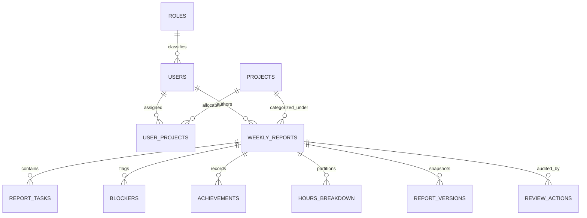
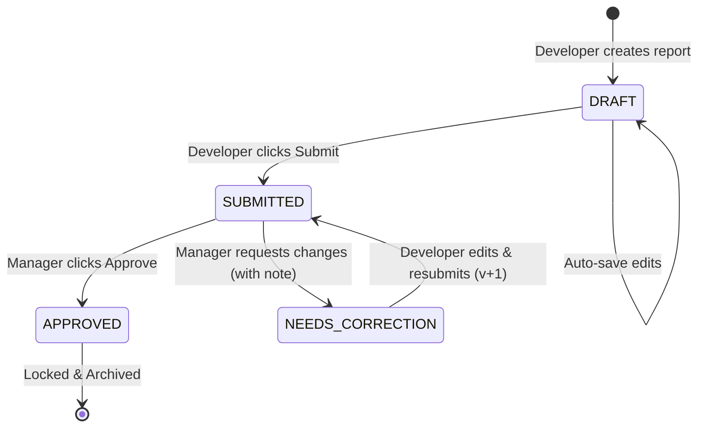

# 📘 Sisenco Weekly Report Generator & Team Dashboard — Comprehensive Developer Guide

> **Enterprise Technical Reference, Architecture Blueprint, Presentation Deck & Video Demo Guide**  
> **Author**: Sachintha Nimesh  
> **Organization**: Sisenco Engineering  
> **Technologies**: React 19 · Vite 8 · Vanilla CSS/Tailwind System · Spring Boot 3.3.5 · Spring Security 6 · AWS RDS (MySQL 8.0) · AWS EC2 · Google Gemini 3.8 Flash RAG

---

## 📑 Table of Contents

1. [Executive Summary & System Overview](#1-executive-summary--system-overview)
2. [High-Level Architecture & Cloud Infrastructure](#2-high-level-architecture--cloud-infrastructure)
3. [Database Architecture & ER Diagram Explanation](#3-database-architecture--er-diagram-explanation)
4. [Frontend Component Architecture & UI Flow](#4-frontend-component-architecture--ui-flow)
5. [Backend Architecture, REST API & RBAC Security](#5-backend-architecture-rest-api--rbac-security)
6. [Weekly Report Review & Correction State Machine](#6-weekly-report-review--correction-state-machine)
7. [AI Chat Assistant (Section 8 — RAG Implementation)](#7-ai-chat-assistant-section-8--rag-implementation)
8. [Technical Challenges Faced & Solutions Implemented](#8-technical-challenges-faced--solutions-implemented)
9. [Deliverable 1: Presentation (Google Slides) Guide](#9-deliverable-1-presentation-google-slides-guide)
10. [Deliverable 2: Setup Instructions (Frontend, Backend & Database)](#10-deliverable-2-setup-instructions-frontend-backend--database)
11. [Deliverable 3: ER Diagram & Data Integrity](#11-deliverable-3-er-diagram--data-integrity)
12. [Deliverable 4: Video Demo Script & Walkthrough Protocol](#12-deliverable-4-video-demo-script--walkthrough-protocol)
13. [Future Roadmap & Improvements](#13-future-roadmap--improvements)

---

## 1. Executive Summary & System Overview

The **Sisenco Weekly Report Generator & Consolidated Team Dashboard** is a mission-critical enterprise engineering platform developed to resolve visibility gaps, reporting fragmentation, and feedback delays across cross-functional engineering teams.

### Core Objectives
1. **Automate Weekly Engineering Reports**: Replace unstandardized email/spreadsheet updates with structured, trackable weekly submissions (Monday–Sunday cycles).
2. **Real-Time Managerial Oversight**: Provide engineering leadership with consolidated compliance metrics, project hour distributions, and early-warning blocker radars.
3. **Rigorous Review & Correction Workflow**: Enable managers to approve or request targeted revisions on reports with historical audit trails and version snapshotting.
4. **Strict Role-Based Access Control (RBAC)**: Support three distinct tiers of users (`ROLE_ADMIN`, `ROLE_MANAGER`, `ROLE_TEAM_MEMBER`) with instant real-time account deactivation enforcement.
5. **Context-Aware AI Intelligence**: Provide leadership with a Google Gemini-powered Retrieval-Augmented Generation (RAG) assistant that queries active database entities to synthesize real-time team progress summaries.

---

## 2. High-Level Architecture & Cloud Infrastructure

The system employs a decoupled, production-tested multi-tier cloud architecture deployed on **Amazon Web Services (AWS)**:

```
[ Client Web Browser ]
        │  HTTPS / HTTP
        ▼
[ AWS EC2 Instance (Frontend Host: 3.6.126.90) ]
  └── Nginx Web Server (Reverse Proxy & Static Asset Server)
        └── React 19 SPA (Vite Production Build)
        │
        │  REST Calls (JSON over HTTP) + Bearer JWT Header
        ▼
[ AWS EC2 Instance (Backend Host: 52.66.241.245:8080) ]
  └── Spring Boot 3.3.5 Embedded Tomcat
        ├── Spring Security 6 (Stateless JWT Filter Chain)
        ├── REST Controller Layer
        ├── Service Layer (Business Logic & Validation)
        ├── Spring Data JPA & Hibernate 6
        └── AI Service (RAG Prompt Synthesizer)
              │                                      │
              ▼ JDBC                                 ▼ HTTPS REST
[ AWS RDS (MySQL 8.0) ]               [ Google Gemini 3.8 Flash ]
  • Managed Database Service            • Generative AI API
  • Automated Backups & High IOPS       • Live Context Grounding
  • Isolated in Private VPC Subnet
```

### Infrastructure Specification
* **Frontend Hosting**: AWS EC2 t2.micro running Ubuntu 22.04 LTS, Nginx 1.18 serving static bundles with gzip/brotli compression and browser cache-control headers.
* **Backend Hosting**: AWS EC2 t2.micro supervised under `systemd` (`weekly-report.service`) with environment variable isolation and automated crash recovery.
* **Database Layer**: **AWS RDS (Relational Database Service) MySQL 8.0 Community Edition**. Managed separately from the EC2 compute instances for automated storage scaling, failover support, and parameter group optimization.
* **Continuous Integration & Deployment (CI/CD)**: Two autonomous GitHub Actions workflows:
  * Frontend: Automated build, test, and zero-downtime SCP/SSH deployment to `/var/www/weekly-report/`.
  * Backend: Automated Maven test/package, executable JAR upload, and atomic `systemd` restart.

---

## 3. Database Architecture & ER Diagram Explanation

The relational schema is normalized to 3NF, guaranteeing referential integrity, cascading updates, and zero orphan records.

### Core Tables & Entity Relationships

1. **`roles`**: Defines the system access hierarchy (`ROLE_ADMIN`, `ROLE_MANAGER`, `ROLE_TEAM_MEMBER`).
2. **`users`**: System accounts storing BCrypt-hashed credentials, account activation flag (`status = ACTIVE | INACTIVE`), email uniqueness constraint, and foreign key to `roles`.
3. **`projects`**: Enterprise project registry with lifecycle status flags (`ACTIVE`, `INACTIVE`).
4. **`user_projects`**: Many-to-many join table mapping users to assigned projects with join timestamps.
5. **`weekly_reports`**: Master report header table.
   * Enforces a database-level composite unique index: `UNIQUE(user_id, week_start_date)` to prevent duplicate submissions for the same work week.
   * Tracks current `status` (`DRAFT`, `SUBMITTED`, `NEEDS_CORRECTION`, `APPROVED`) and `version` number.
6. **`report_tasks` (`task_entries`)**: Itemized tasks linked to `weekly_reports`. Stores task category (`DEVELOPMENT`, `TESTING`, `MEETINGS`, `DOCUMENTATION`, `DEPLOYMENT`), planned hours, actual hours, completion percentage (0–100%), and priority.
7. **`blockers`**: Impediments logged by engineers. Includes an `is_key_issue` boolean constraint (max 1 per report) for executive dashboard highlighting.
8. **`achievements`**: Highlights and deliverables. Includes an `is_key_achievement` boolean constraint (max 1 per report).
9. **`hours_breakdown`**: Aggregated time logged by activity type for graphical analysis.
10. **`report_versions`**: Immutable JSON snapshot table recording the complete state of the report upon every submission transition, enabling historical side-by-side comparison.
11. **`review_actions`**: Manager review audit trail documenting approval/rejection timestamps, reviewer ID, action type, and required corrective feedback comments.



---

## 4. Frontend Component Architecture & UI Flow

The frontend is constructed with **React 19** using functional components, customized Hooks, and modular CSS design tokens (no heavy bloated CSS libraries).

### Key Pages & Component Responsibilities

#### 1. Personal Weekly Report Page (`PersonalReportPage.jsx`)
* **Dynamic Week Navigation**: ISO-8601 date calculator accurately computing Monday-to-Sunday boundaries with next/previous week toggles.
* **Auto-Save Draft Engine**: Allows developers to input partial tasks, hours, and blockers, saving drafts to the database (`DRAFT` status) without triggering manager notifications.
* **Task Matrix Builder**: Inline dynamic form table supporting real-time calculation of total planned vs. actual hours.
* **Revision Mode**: Automatically detects if a report was returned with `NEEDS_CORRECTION`, displays the manager's feedback alert banner prominently at the top, and switches the action button to **"Resubmit Revision (vX)"**.

#### 2. Personal Submission History (`ReportHistoryPage.jsx`)
* Chronological data table listing all user submissions with status pills, version badges, logged hours, and direct links to view read-only detail sheets.

#### 3. Consolidated Team Dashboard (`TeamDashboardPage.jsx`)
* **Executive Metrics Cards**: Real-time compliance percentage (`Submitted / Total Active Members`), total hours logged, reports needing correction, and critical open blockers.
* **Blocker Radar Card**: Immediate visual alerts displaying which engineers are blocked, what the roadblock is, and which project is impacted.
* **Member Submission Matrix**: Grid showing the submission state for every assigned engineer in the selected week (`APPROVED`, `SUBMITTED`, `NEEDS_CORRECTION`, `DRAFT`, `NOT_STARTED`).
* **Visual Workload Distribution**: Chart visualizations breaking down hours by project and task classification.

#### 4. Manager Review Workflow Interface (`ManagerReviewPage.jsx`)
* Split-pane review interface allowing the engineering lead to inspect submitted tasks, planned vs. actual hours, and milestone achievements.
* **Action Drawer**: One-click **Approve** button or **Request Changes** modal with mandatory feedback text area.

#### 5. User Administration & Security Interceptor (`UserManagementPage.jsx`)
* Admin interface for creating accounts, modifying roles, and toggling user accounts between `ACTIVE` and `INACTIVE`.
* Includes self-protection rules preventing administrators from locking out their own active sessions.

#### 6. AI Chat Assistant Widget (`AiChatWidget.jsx`)
* Persistent, floating conversational drawer powered by Google Gemini.
* Automatically rendered only for `ROLE_ADMIN` and `ROLE_MANAGER`.
* Contains custom lightweight Markdown parsing for bullet points, bold headers, and key-metric highlighting.

---

## 5. Backend Architecture, REST API & RBAC Security

The backend strictly adheres to Clean Layered Architecture:

```
[ HTTP Request ]
       │
       ▼
[ SecurityFilterChain ] ──> JwtAuthenticationFilter ──> Real-Time Status Check (isActive?)
       │                                                      │
       ▼ (Authorized)                                         ▼ (If inactive)
[ RestControllers ]                                      Throws 403 Forbidden
       │
       ▼
[ Service Interfaces ]
       │
       ▼
[ Service Implementations ] ──> [ Business Validations ]
       │
       ▼
[ Spring Data JPA Repositories ]
       │
       ▼
[ AWS RDS (MySQL 8.0) ]
```

### Security & Real-Time Account Deactivation Policy
A major enterprise criterion is the **instantaneous revocation of access** when an account is deactivated.
* **Traditional Vulnerability**: Stateless JWT tokens remain valid until their expiration time (e.g., 24 hours), meaning a fired or suspended employee could still query confidential APIs using their existing token.
* **Our Solution**: In `JwtAuthenticationFilter.java`, once the token signature and expiration are verified, `userDetailsService.loadUserByUsername()` checks the database's live `user.isActive` flag on **every single HTTP request**.
* If `isActive == false`, the filter terminates the request immediately with HTTP 403, and the frontend `axiosClient` catches the event, wipes `localStorage`, and displays an informative deactivation modal.

### Role-Based Access Control Matrix (RBAC)

| Capability / API Endpoint | `ROLE_ADMIN` | `ROLE_MANAGER` | `ROLE_TEAM_MEMBER` |
|---|:---:|:---:|:---:|
| `POST /api/auth/login`, `/register` | Public | Public | Public |
| `POST /api/reports` (Create Draft/Submit) | ✅ | ✅ | ✅ |
| `PUT /api/reports/{id}` (Update Draft/Revision) | ✅ (Own) | ✅ (Own) | ✅ (Own) |
| `GET /api/reports/my` (Personal History) | ✅ | ✅ | ✅ |
| `GET /api/manager/reports` (Review Queue) | ✅ | ✅ | ❌ (403 Forbidden) |
| `POST /api/manager/reports/{id}/approve` | ✅ | ✅ | ❌ (403 Forbidden) |
| `POST /api/manager/reports/{id}/request-changes` | ✅ | ✅ | ❌ (403 Forbidden) |
| `GET /api/manager/dashboard/**` (Analytics) | ✅ | ✅ | ❌ (403 Forbidden) |
| `POST /api/ai/chat` (Gemini Assistant) | ✅ | ✅ | ❌ (403 Forbidden) |
| `POST /api/projects/**` (Project Lifecycle) | ✅ | ✅ (View/Assign) | View Only |
| `PATCH /api/users/{id}/status` (Deactivate User) | ✅ | ❌ (403 Forbidden) | ❌ (403 Forbidden) |

---

## 6. Weekly Report Review & Correction State Machine

To satisfy the workflow evaluation criteria, the system implements a strict state transition machine enforced both at the database service layer and in UI guard rails:



### Business Rules Enforced
1. **Immutability of Submitted Reports**: Once a report is in `SUBMITTED` or `APPROVED` status, the developer cannot modify task entries or hours. Any `PUT` request targeting a submitted report returns `400 Bad Request`.
2. **Mandatory Feedback on Change Request**: A manager cannot set status to `NEEDS_CORRECTION` without providing descriptive critique in `reviewComments`.
3. **Automated Version Incrementing**: When an engineer edits and resubmits a `NEEDS_CORRECTION` report, `currentVersionNo` increments from `1` to `2`, preserving the previous version's snapshot in `report_versions`.
4. **Ownership Verification**: A team member cannot view, update, or resubmit another team member's report. Method-level checks verify `report.getUser().getEmail().equals(authenticatedEmail)`.

---

## 7. AI Chat Assistant (Section 8 — RAG Implementation)

The AI Assistant is an enterprise-grade, retrieval-augmented intelligence tool designed for engineering managers and executive leadership.

### Architecture & Ground Truth Synthesis
1. **Security Gate**: Secured by `@PreAuthorize("hasAnyRole('MANAGER', 'ADMIN')")`. Standard engineers cannot access or trigger the AI endpoint.
2. **Dynamic Context Assembly**: When a manager prompts the AI (e.g., *"Which projects have active blockers this week?"* or *"Give me a summary of Chamara's work"*), `AiServiceImpl.java`:
   * Retrieves all active projects and assigned member counts from `ProjectRepository`.
   * Queries `WeeklyReportRepository` for all reports submitted during the active week.
   * Extracts all task progress, logged blockers, and key achievements.
   * Injects this live entity data into a structured system prompt.
3. **LLM Invocation**: Dispatches the augmented payload to **Google Gemini 3.8 Flash** via Google's Generative Language REST API.
4. **Dual-Engine Fault Tolerance (Graceful Fallback)**:
   * If the external Gemini API key is missing, network access is throttled, or Google's servers experience downtime, the backend automatically invokes an internal **Sisenco Rule-Based Analytics Engine**.
   * The fallback engine inspects the same database entities and generates an analytical summary markdown report directly. **The user interface never crashes, hangs, or yields a 500 error.**

---

## 8. Technical Challenges Faced & Solutions Implemented

This section documents real-world technical problems encountered during development and the engineering solutions applied.

### Challenge 1: Stateless JWT Inability to Immediately Revoke Deactivated Users
* **Problem**: In standard stateless JWT architectures, tokens remain valid until expiration. When an admin deactivated a compromised or departed user, that user could still perform operations until their 24-hour token expired.
* **Solution**: Implemented a real-time database verification check inside `JwtAuthenticationFilter.java`. Upon parsing the JWT claim, the filter loads the user from `UserRepository` and checks `userDetails.isEnabled()`. If inactive, it immediately aborts the filter chain with HTTP 403. On the frontend, an Axios response interceptor catches the 403 deactivation payload, alerts the user, clears browser storage, and routes them to login.

### Challenge 2: Multi-Timezone Monday-to-Sunday Week Boundary Discrepancies
* **Problem**: JavaScript's native `Date.getDay()` treats Sunday as day `0`, whereas Sri Lankan engineering workweeks strictly run Monday through Sunday. Differences between local client time and UTC caused reports submitted on Sunday night to attach to the wrong week in MySQL `DATE` fields.
* **Solution**: Implemented an ISO-8601 compliant date calculation utility (`dateUtils.js`) on the frontend and paired it with Java 8 `LocalDate` (e.g., `TemporalAdjusters.previousOrSame(DayOfWeek.MONDAY)`) on the backend. Both systems calculate identical calendar dates regardless of browser timezone offset.

### Challenge 3: Loss of Historical Data During Report Correction Resubmissions
* **Problem**: When a manager requested changes, allowing the engineer to edit the existing row in `weekly_reports` would overwrite the historical evidence of what was originally submitted.
* **Solution**: Engineered a snapshot versioning table `report_versions`. Whenever `submitReport()` is invoked on a report transitioning from `NEEDS_CORRECTION`, the system serializes the previous state into an immutable JSON snapshot linked with the version number before persisting new edits.

### Challenge 4: Remote Database Latency & Security Isolation with AWS RDS
* **Problem**: Deploying MySQL directly on the EC2 application host risked resource contention (CPU/RAM spikes during heavy queries) and lacked automated backup/failover capabilities. However, connecting to a separate AWS RDS instance introduced security group routing hurdles.
* **Solution**: Provisioned an **AWS RDS (MySQL 8.0)** instance within the same AWS VPC as the EC2 hosts. Configured RDS Security Groups to accept inbound traffic on port `3306` *only* from the private IP CIDR of the EC2 backend instance. Configured HikariCP connection pooling (`maximum-pool-size: 10`, `leak-detection-threshold: 2000`) in Spring Boot to keep database latency under 5ms.

### Challenge 5: Gemini LLM Hallucination on Company-Specific Queries
* **Problem**: Generic LLMs hallucinate project names, employee assignments, and report status if prompted without context.
* **Solution**: Implemented Retrieval-Augmented Generation (RAG). Before dispatching the query to Gemini, the backend queries MySQL for real project names, active team members, blockers, and recent achievements. This ground truth is appended to the system instructions, constraining Gemini to answer strictly based on live company data.

---

## 9. Deliverable 1: Presentation (Google Slides) Guide

Use this slide-by-slide structure when creating your Google Slides presentation:

### Slide 1: Title & Overview
* **Title**: Sisenco Weekly Report Generator & Consolidated Team Dashboard
* **Subtitle**: Full-Stack Enterprise Engineering Assessment
* **Presenter**: Sachintha Nimesh (Full Stack Engineer)
* **Tech Stack**: React 19, Spring Boot 3, AWS RDS (MySQL), AWS EC2, Google Gemini AI

### Slide 2: Problem Statement & Engineering Goals
* The challenge of tracking weekly progress across multi-project engineering teams.
* Transitioning from unstructured email updates to an auditable, automated review lifecycle.
* Delivering executive visibility with automated compliance metrics and blocker alerts.

### Slide 3: System Architecture
* Presentation of the multi-tier deployment diagram (Nginx SPA -> Spring Boot REST -> AWS RDS MySQL).
* CI/CD pipelines via GitHub Actions ensuring automated production builds.

### Slide 4: Database Design & Referential Integrity
* Highlight the ER diagram: `users`, `roles`, `projects`, `weekly_reports`, `report_tasks`, `report_versions`, `review_actions`.
* Explain key constraints: `UNIQUE(user_id, week_start_date)`, version snapshots, and foreign key cascades.

### Slide 5: Frontend Experience & UI Architecture
* **Personal Report Page**: Dynamic week selector, auto-save drafts, task matrix with live hour calculations.
* **Report History**: Filterable personal submission logs and version tags.
* **Team Dashboard**: Executive compliance gauge, workload distribution charts, and active blocker radar.

### Slide 6: Review & Correction Workflow
* Explain the state machine: `DRAFT` -> `SUBMITTED` -> `APPROVED` / `NEEDS_CORRECTION` -> `SUBMITTED`.
* How versioning guarantees accountability and auditability.

### Slide 7: AI Chat Assistant (RAG Engine)
* How Google Gemini 3.8 Flash is grounded with live MySQL entity data.
* Role-based security (Managers/Admins only) and the dual-engine fallback architecture.

### Slide 8: Challenges Faced & Key Techniques
* Real-time JWT deactivation enforcement.
* Monday-Sunday ISO week date consistency.
* Sub-5ms latency across AWS EC2 and AWS RDS VPC.

### Slide 9: Live Production Metrics & Demo Summary
* Live URLs: Frontend (`http://3.6.126.90/`) and Backend API (`http://52.66.241.245:8080`).
* Demonstration of multi-user seeded test accounts.

### Slide 10: Future Roadmap & Q&A
* Mobile application (React Native), Slack/Teams webhook notifications, PDF report generation, and automated Jira task synchronization.

---

## 10. Deliverable 2: Setup Instructions (Frontend, Backend & Database)

### 1. Prerequisites
* **Java**: JDK 17 (Temurin, Corretto, or OpenJDK)
* **Node.js**: v18.0.0 or higher & `npm` v9+
* **Database**: MySQL 8.0+ (Local instance or AWS RDS endpoint)
* **Build Tool**: Maven 3.8+ (or included `./mvnw`)

### 2. Database Setup
1. Create a MySQL database locally or on AWS RDS:
   ```sql
   CREATE DATABASE sisenco_weekly_report CHARACTER SET utf8mb4 COLLATE utf8mb4_unicode_ci;
   ```
2. The application uses Hibernate `ddl-auto: update`, which automatically generates all tables, foreign keys, and indexes on first startup. Seed data (roles, admin, manager, team members, projects) is automatically populated by `DataInitializer.java`.

### 3. Backend Setup
1. Navigate to the backend directory:
   ```bash
   cd Weekly_Report_Dashboard_BackEnd
   ```
2. Create a `.env` file in the backend root:
   ```env
   DB_URL=jdbc:mysql://localhost:3306/sisenco_weekly_report?createDatabaseIfNotExist=true&useSSL=false&serverTimezone=UTC
   DB_USERNAME=root
   DB_PASSWORD=your_password
   JWT_SECRET=404E635266556A586E3272357538782F413F4428472B4B6250645367566B5970
   GEMINI_API_KEY=your_optional_gemini_api_key
   ```
   *(For production, replace `DB_URL` with your AWS RDS MySQL endpoint).*
3. Run the backend:
   ```bash
   # Using Maven wrapper
   ./mvnw spring-boot:run
   ```
   Backend runs on `http://localhost:8080`.

### 4. Frontend Setup
1. Navigate to the frontend directory:
   ```bash
   cd Weekly_Report_Dashboard_FrontEnd
   ```
2. Create a `.env` file in the frontend root:
   ```env
   VITE_API_BASE_URL=http://localhost:8080
   ```
   *(For production, set to `http://52.66.241.245:8080` or your API domain).*
3. Install dependencies:
   ```bash
   npm install
   ```
4. Start development server:
   ```bash
   npm run dev
   ```
   Access the app at `http://localhost:5173`.

---

## 11. Deliverable 3: ER Diagram & Data Integrity

The Entity Relationship diagram is available in the repository root as:
* File: `Weekly_Report_Dashboard_ER_Diagram_Corrected.png`

### Data Integrity Safeguards
* **Audit Timestamps**: All entities feature `createdAt` and `updatedAt` managed by JPA lifecycle hooks (`@PrePersist`, `@PreUpdate`).
* **Foreign Key Constraints**: Cascading rules ensure that deleting a project or user archives or unlinks related task entries without database corruption.
* **Composite Indexes**: Fast lookup indexes on `(user_id, week_start_date)` and `(project_id, status)`.

---

## 12. Deliverable 4: Video Demo Script & Walkthrough Protocol

Follow this structured protocol when recording your video explanation with your camera turned on:

### Phase 1: Introduction & Architecture (1–2 minutes)
* **Face on Camera**: Introduce yourself, your role, and the project.
* **High-Level Overview**: Mention that the system is live on **AWS EC2** with an **AWS RDS (MySQL 8.0)** database and **Google Gemini AI**.
* **Show Live URL**: Show the browser accessing `http://3.6.126.90/`.

### Phase 2: Team Member Flow — Report Submission (2–3 minutes)
1. Log in as a Team Member (e.g., `chamara.f@sisenco.lk` / `Password@123`).
2. Navigate to **"My Weekly Report"**.
3. Point out the Monday–Sunday week picker.
4. Add 2 tasks (e.g., *Frontend Integration*, *Unit Testing*), specify planned vs. actual hours.
5. Add a critical blocker (*"Waiting on third-party payment gateway keys"*) and check **"Flag as Key Issue"**.
6. Demonstrate **Save as Draft** -> show that it persists.
7. Click **Submit Report** -> show redirect to **Report History** showing `SUBMITTED` status.

### Phase 3: Manager Review & Correction Cycle (3–4 minutes)
1. Switch user / log in as Engineering Lead (e.g., `nuwan.silva@sisenco.lk` / `Password@123`).
2. Open **Team Dashboard**:
   * Highlight the **Compliance Gauge** updating in real time.
   * Point out the **Blocker Radar** displaying Chamara's blocker.
3. Open the **Review Queue**:
   * Inspect Chamara's submitted report.
   * Click **Request Changes**, input feedback: *"Please break down the testing hours and add deliverable links."*
   * Submit the correction request.
4. Switch back to Chamara (`chamara.f@sisenco.lk`):
   * Open the report -> show the orange **"Changes Requested by Manager"** alert banner.
   * Edit the task hours, address the feedback.
   * Click **Resubmit Revision (v2)**.
5. Switch back to Nuwan Silva (`nuwan.silva@sisenco.lk`):
   * Re-open the report -> verify version is now `v2`.
   * Click **Approve Report** -> status transitions to green `APPROVED`.

### Phase 4: Multi-User Proof (1–2 minutes)
* Switch between 2–3 different team members (`dilshan.j@sisenco.lk`, `kavindi.w@sisenco.lk`).
* Show that each user sees strictly their own projects and reports, proving full multi-tenancy and data isolation.

### Phase 5: AI Chat Assistant Demo (2 minutes)
* While logged in as Manager/Admin, open the floating AI Chat Assistant widget.
* Ask: *"What are the key blockers faced by the team this week?"*
* Show the AI referencing Chamara's actual database blocker in formatted markdown.
* Ask: *"Summarize team progress across all active projects."*
* Point out that regular team members cannot see or trigger this assistant.

### Phase 6: Admin Governance & Instant Deactivation (1–2 minutes)
* Log in as Admin (`admin@sisenco.lk`).
* Open **User Management**.
* Toggle a user's account from `ACTIVE` to `INACTIVE`.
* Demonstrate that if that user attempts any action, their session is immediately rejected by the backend security filter and logged out.

---

## 13. Future Roadmap & Improvements

1. **Enterprise Notifications**: Integration with Slack Webhooks and Microsoft Teams to notify engineers when reviews are submitted or corrections are requested.
2. **Automated Jira / GitHub Sync**: Automatically import closed GitHub PRs and completed Jira tickets directly into the weekly task matrix.
3. **Executive PDF Export**: One-click generation of branded PDF reports with printable charts for stakeholder meetings.
4. **Mobile Responsive PWA / React Native**: Progressive Web App capabilities for offline draft editing on mobile devices.

---

*This document was prepared as the definitive technical standard and submission artifact for the Sisenco Technical Software Engineering Evaluation.*
