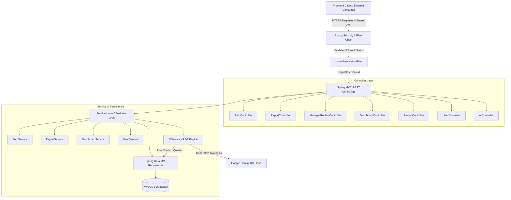
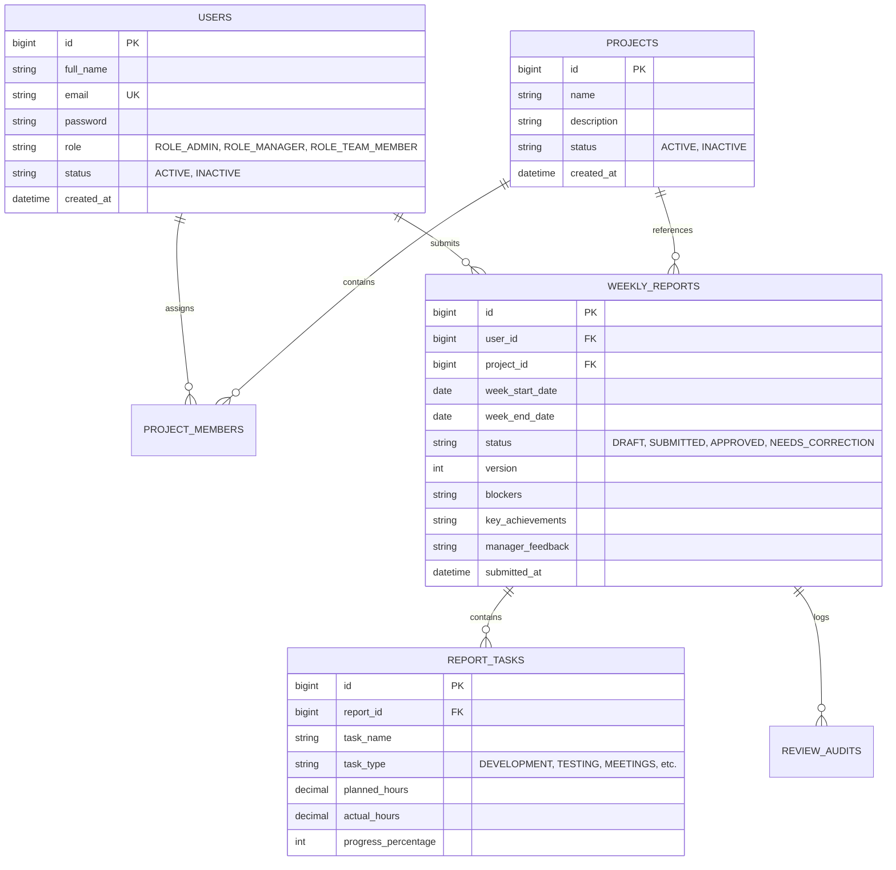

# ⚙️ Sisenco Weekly Report & Team Dashboard — Backend REST API

[](https://www.oracle.com/java/)
[](https://spring.io/projects/spring-boot)
[](https://spring.io/projects/spring-security)
[](https://www.mysql.com/)
[](https://hibernate.org/)
[](https://ai.google.dev/)
[](https://github.com/features/actions)
[](https://aws.amazon.com/ec2/)

Production-grade **Spring Boot 3 REST API** serving the **Sisenco Weekly Report Generator and Consolidated Team Dashboard**. Built with clean architecture, enterprise role-based access control (RBAC), database auditing, real-time account deactivation enforcement, and a **Retrieval-Augmented Generation (RAG) AI Assistant powered by Google Gemini**.

---

## 📑 Table of Contents
- [Architecture & Layers](#-architecture--layers)
- [Live Deployment & Environments](#-live-deployment--environments)
- [Security & Authentication Model](#-security--authentication-model)
  - [JWT Stateless Filter Chain](#jwt-stateless-filter-chain)
  - [Real-Time Account Deactivation Policy](#real-time-account-deactivation-policy)
- [REST API Reference](#-rest-api-reference)
  - [1. Authentication (`/api/auth`)](#1-authentication-apiauth)
  - [2. Weekly Report Management (`/api/reports`)](#2-weekly-report-management-apireports)
  - [3. Manager Review Workflow (`/api/manager/reviews`)](#3-manager-review-workflow-apimanagerreviews)
  - [4. Consolidated Dashboard (`/api/dashboard`)](#4-consolidated-dashboard-apidashboard)
  - [5. Project Management (`/api/projects`)](#5-project-management-apiprojects)
  - [6. User Administration (`/api/users`)](#6-user-administration-apiusers)
  - [7. AI Chat Assistant (`/api/ai/chat`)](#7-ai-chat-assistant-apiaichat)
- [AI Engine Architecture (Section 8)](#-ai-engine-architecture-section-8)
- [Database Schema (ER Diagram)](#-database-schema-er-diagram)
- [Getting Started Locally](#-getting-started-locally)
- [Environment Configuration](#-environment-configuration)
- [CI/CD Pipeline & EC2 Deployment](#-cicd-pipeline--ec2-deployment)

---

## 🏛 Architecture & Layers



---

## 🚀 Live Deployment & Environments

- **Production Host**: AWS EC2 Linux (`Ubuntu 22.04 LTS`)
- **Base REST URL**: `http://52.66.241.245:8080`
- **Database**: MySQL 8.0 with automated Hibernate DDL updates
- **Process Supervision**: Systemd (`weekly-report.service`)

---

## 🔐 Security & Authentication Model

### JWT Stateless Filter Chain
- Authentication operates via stateless JSON Web Tokens signed with HMAC-SHA256.
- All secured requests require the header:
  ```http
  Authorization: Bearer <JWT_TOKEN>
  ```
- Configured in `SecurityConfig.java` with CSRF disabled, CORS configured for the frontend host, and `SessionCreationPolicy.STATELESS`.

### Real-Time Account Deactivation Policy
- In compliance with enterprise security requirements, when an administrator sets a user's status to `INACTIVE`, the user's access is **terminated immediately**.
- `JwtAuthenticationFilter.java` verifies `userDetails.isEnabled()` on **every single incoming HTTP request**.
- If a deactivated user attempts any action, the request is immediately rejected with HTTP `403 Forbidden` / `401 Unauthorized` and an informative payload:
  ```json
  {
    "success": false,
    "message": "Your account has been deactivated. Please contact an administrator.",
    "timestamp": "2026-09-06T13:40:00"
  }
  ```

---

## 📡 REST API Reference

All successful responses follow the standardized `ApiResponse<T>` envelope:
```json
{
  "success": true,
  "message": "Operation description",
  "data": { ... },
  "timestamp": "2026-09-06T12:00:00"
}
```

### 1. Authentication (`/api/auth`)
| Method | Endpoint | Required Role | Description |
| :--- | :--- | :--- | :--- |
| `POST` | `/api/auth/register` | Public | Register a new user account (defaults to `ROLE_TEAM_MEMBER`) |
| `POST` | `/api/auth/login` | Public | Authenticate with email & password; returns JWT token and user profile |
| `GET` | `/api/auth/profile` | Authenticated | Retrieve authenticated user profile and assigned projects |

### 2. Weekly Report Management (`/api/reports`)
| Method | Endpoint | Required Role | Description |
| :--- | :--- | :--- | :--- |
| `GET` | `/api/reports` | Authenticated | Get paginated weekly reports for the logged-in user |
| `GET` | `/api/reports/{id}` | Authenticated | Retrieve complete report details (tasks, blockers, achievements, audit trail) |
| `POST` | `/api/reports` | Authenticated | Create a new report draft or submit a new report |
| `PUT` | `/api/reports/{id}` | Authenticated | Update an existing draft or resubmit a report marked `NEEDS_CORRECTION` |
| `POST` | `/api/reports/{id}/submit` | Authenticated | Transition report from `DRAFT` to `SUBMITTED` |
| `GET` | `/api/reports/check` | Authenticated | Check if a report exists for a specific user, project, and week range |

### 3. Manager Review Workflow (`/api/manager/reviews`)
| Method | Endpoint | Required Role | Description |
| :--- | :--- | :--- | :--- |
| `GET` | `/api/manager/reviews/pending` | `MANAGER`, `ADMIN` | List all submitted reports awaiting review across all teams |
| `POST` | `/api/manager/reviews/{id}/approve` | `MANAGER`, `ADMIN` | Approve a submitted report (`APPROVED`) with manager audit log |
| `POST` | `/api/manager/reviews/{id}/request-changes` | `MANAGER`, `ADMIN` | Request corrections (`NEEDS_CORRECTION`) with inline manager comments |

### 4. Consolidated Dashboard (`/api/dashboard`)
| Method | Endpoint | Required Role | Description |
| :--- | :--- | :--- | :--- |
| `GET` | `/api/dashboard/stats` | `MANAGER`, `ADMIN` | Team compliance rate, active submissions, open blockers, hours breakdown |
| `GET` | `/api/dashboard/members` | `MANAGER`, `ADMIN` | Status summary per team member for the selected week |

### 5. Project Management (`/api/projects`)
| Method | Endpoint | Required Role | Description |
| :--- | :--- | :--- | :--- |
| `GET` | `/api/projects` | Authenticated | List all projects (includes assigned members and active status) |
| `GET` | `/api/projects/{id}` | Authenticated | Get detailed project information |
| `POST` | `/api/projects` | `ADMIN` | Create a new enterprise project |
| `PUT` | `/api/projects/{id}` | `ADMIN` | Update project metadata and member allocations |
| `PATCH` | `/api/projects/{id}/status` | `ADMIN` | Activate or deactivate project |
| `DELETE` | `/api/projects/{id}` | `ADMIN` | Delete project |

### 6. User Administration (`/api/users`)
| Method | Endpoint | Required Role | Description |
| :--- | :--- | :--- | :--- |
| `GET` | `/api/users` | `ADMIN` | Retrieve all registered users with roles, statuses, and project counts |
| `POST` | `/api/users` | `ADMIN` | Provision a new user account with designated role |
| `PATCH` | `/api/users/{id}/status` | `ADMIN` | Toggle user status (`ACTIVE` / `INACTIVE`) with self-protection checks |
| `PATCH` | `/api/users/{id}/role` | `ADMIN` | Update role (`ROLE_ADMIN`, `ROLE_MANAGER`, `ROLE_TEAM_MEMBER`) |

### 7. AI Chat Assistant (`/api/ai/chat`)
| Method | Endpoint | Required Role | Description |
| :--- | :--- | :--- | :--- |
| `POST` | `/api/ai/chat` | `MANAGER`, `ADMIN` | Send conversational queries about team activity, blockers, and workloads |

---

## 🤖 AI Engine Architecture (Section 8)

The backend implements Section 8 of the Technical Specification:
- **Model**: `gemini-3.8-flash` via Google Generative Language REST API.
- **RAG Context Assembly**:
  1. Pulls active enterprise projects from `ProjectRepository`.
  2. Aggregates submitted weekly reports, blockers, and key achievements from `WeeklyReportRepository`.
  3. Synthesizes an augmented prompt containing company ground truth.
- **Data Privacy & Least Privilege**:
  - The endpoint is secured with `@PreAuthorize("hasAnyRole('MANAGER', 'ADMIN')")`.
  - Regular team members are barred from executing cross-team intelligence queries.
- **Dual-Engine Fault Tolerance**:
  - If the Gemini API key is absent, rate-limited, or unreachable, the service automatically falls back to an internal **Sisenco Reports Analytics Engine** so the user experience never degrades or throws 500 errors.

---

## 🗄 Database Schema (ER Diagram)



---

## 🛠 Getting Started Locally

### Prerequisites
- **JDK 17** (Temurin, Corretto, or OpenJDK)
- **Maven 3.8+** (or bundled `./mvnw`)
- **MySQL 8.0+**

### 1. Clone the Repository
```bash
git clone https://github.com/SachinthaNimesh370/Weekly_Report_dashboard_backend.git
cd Weekly_Report_dashboard_backend
```

### 2. Configure Environment Variables
Create a local `.env` file (which is gitignored) or set environment variables:
```bash
DB_URL=jdbc:mysql://localhost:3306/sisenco_weekly_report?createDatabaseIfNotExist=true&useSSL=false&serverTimezone=UTC
DB_USERNAME=root
DB_PASSWORD=your_mysql_password
JWT_SECRET=404E635266556A586E3272357538782F413F4428472B4B6250645367566B5970
GEMINI_API_KEY=your_gemini_api_key_here
```

### 3. Build & Run
Using the Maven wrapper:
```bash
./mvnw clean spring-boot:run
```
Or build the executable JAR:
```bash
./mvnw clean package -DskipTests
java -jar target/Weekly_Report_Dashboard_BackEnd-0.0.1-SNAPSHOT.jar
```

The server starts on **`http://localhost:8080`**.

---

## 🌐 Environment Configuration Reference

| Variable | Default / Example | Description |
| :--- | :--- | :--- |
| `DB_URL` | `jdbc:mysql://52.66.241.245:3306/sisenco` | JDBC database connection string |
| `DB_USERNAME` | `sisenco_user` | MySQL database user |
| `DB_PASSWORD` | `******` | MySQL database password |
| `JWT_SECRET` | 256-bit hex/base64 string | Secret key for signing authentication tokens |
| `JWT_EXPIRATION_MS` | `86400000` (24 hours) | Token validity duration in milliseconds |
| `GEMINI_API_KEY` | *(Optional)* | Google Generative Language API key for AI Assistant |
| `GEMINI_MODEL` | `gemini-3.8-flash` | Gemini model identifier |

---

## 🚢 CI/CD Pipeline & EC2 Deployment

Backend deployment is automated via GitHub Actions ([`.github/workflows/deploy.yml`](.github/workflows/deploy.yml)):

1. **Build Stage**:
   - Triggers on push to `main`.
   - Compiles and tests project with Java 17 Temurin on `ubuntu-latest`.
   - Packages standalone production JAR and uploads build artifact.
2. **Deploy Stage**:
   - Downloads compiled JAR artifact.
   - Securely copies JAR to AWS EC2 via `appleboy/scp-action`.
   - Injects `GEMINI_API_KEY` into the systemd environment if provided.
   - Restarts `weekly-report` service via systemd (`sudo systemctl restart weekly-report`).
   - Verifies process status (`sudo systemctl status weekly-report`).
